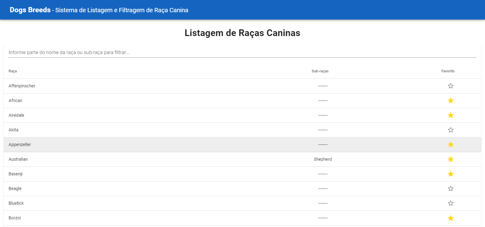

<h4 align="center">
  🚀 Dogs Breeds - Sistema de Listagem e Filtragem de Raça Canina
</h4>

<p align="center">
 

  
</p>

<p align="center">
  <a href="#rocket-tecnologias">Tecnologias</a>&nbsp;&nbsp;&nbsp;|&nbsp;&nbsp;&nbsp;
  <a href="#-projeto">Projeto</a>&nbsp;&nbsp;&nbsp;|&nbsp;&nbsp;&nbsp;
  <a href="#-funcionalidades">Funcionalidades</a>&nbsp;&nbsp;&nbsp;|&nbsp;&nbsp;&nbsp;
  <a href="#-requisitos">Requisitos</a>&nbsp;&nbsp;&nbsp;|&nbsp;&nbsp;&nbsp;
  <a href="#-instalação">Instalação</a>&nbsp;&nbsp;&nbsp;|&nbsp;&nbsp;&nbsp;
</p>

<br>

<p align="center">
  
</p>

## :rocket: Tecnologias

Esse projeto foi desenvolvido com as seguintes tecnologias:

- [Vue 2](https://nodejs.org/en/)


## 💻 Projeto

Dogs Breeds é um sistema feito como teste técnico para o processo seletivo de programador frontend Vue.js na empresa Psicologia Viva


## 💻 Funcionalidades

O sistema possui listagem e filtragem de raças de cães além de poder favoritar/desfavoritar uma raça de forma permanente mesmo recarregando o navegador. O projeto original do sistema também exibia uma foto da raça do cão junto com um lightbox. Por questões de performance, foi removida essa funcionalidade uma vez que a API Restful que retorna a listagem de raças não suportava paginação de registros.


## 📄 Requisitos

* Node 12+ com npm 8+ e Vue-cli


## ⚙️ Instalação e execução

**Windows, OS X & Linux:**

Baixe o arquivo zip e o descompacte ou baixe o projeto para sua máquina através do git clone [https://github.com/randercarlos/dogs-breeds.git](https://github.com/randercarlos/dogs-breeds.git)


- Entre no prompt de comando e vá até a pasta do projeto:

```sh
cd ir-ate-a-pasta-do-projeto
```

- Instale as dependências do Vue através do comando:

```sh
yarn
```

- Com as dependências instaladas, execute o comando:

```sh
yarn serve
```

Espere compilar o projeto!

- Se tudo der certo, o terminal exibirá uma mensagem que o projeto estará rodando no endereço [http://localhost:8080](http://localhost:8080). Abra esse endereço no navegador para ver o projeto rodando.


Desenvolvido por Rander Carlos :wave: [Linkedin!](https://www.linkedin.com/in/rander-carlos-caetano-freitas-308a63a8/)
